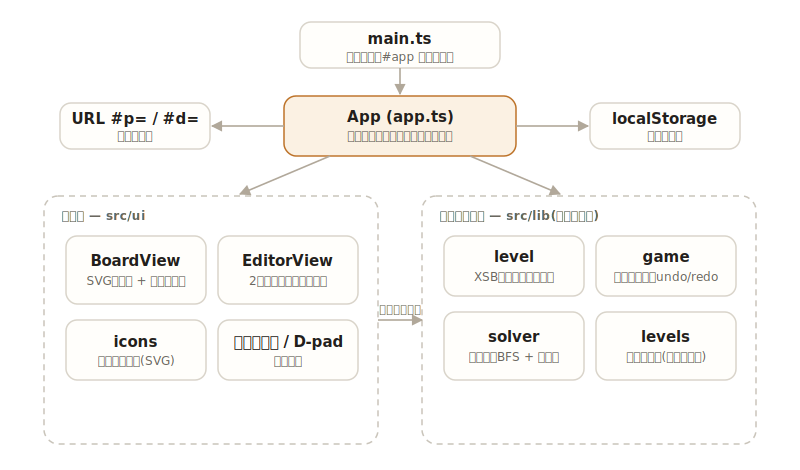

# soko

[](https://github.com/miruky/soko/actions/workflows/ci.yml)
[](https://github.com/miruky/soko/actions/workflows/deploy.yml)
[](https://www.typescriptlang.org/)
[](LICENSE)

**ブラウザで遊ぶ倉庫番。箱をすべてゴールへ押し込む。詰まったら最短手を自動で探し、自分で作った盤面はURLで送れる**

デモ: https://miruky.github.io/soko/

## 概要

sokoは倉庫番(箱を押してゴールに収めるパズル)を、サーバーなしでブラウザ内に閉じて実装したものである。矢印キーかWASD、画面下のD-padで人を動かす。箱は引けず、向こう側が空いているときだけ押せる。すべての箱がゴールに乗るとクリアになり、手数と押し回数が記録される。内蔵レベルのクリア状況と自己最少記録はlocalStorageに残る。

行き詰まったときのために、現在の配置から「最短何回の押しで解けるか」を探索するソルバーを積んでいる。解けるなら手順をその場で再生し、解けない配置(箱を角に押し込んでしまったなど)はそう告げる。探索は押し回数を最小化する幅優先探索で、ゴールへ二度と動かせない「死にマス」をあらかじめ求めて枝刈りする。

レベルエディタを内蔵する。壁・ゴール・箱・人を塗って盤面を作り、その場で試せる。盤面はXSB記法(倉庫番の標準的なテキスト形式)に変換してURLのフラグメントへ載せるので、リンクを送るだけで相手の画面に同じ問題が開く。サーバーに保存しないため、共有してもどこにもデータは残らない。

### なぜ作ったのか

倉庫番は実装の練習として手頃に見えて、「最適手で解く」と「人が作った盤面を共有する」を足すと途端に歯ごたえが出る。手詰まりの検出を真面目にやらないとソルバーは状態爆発で返ってこないし、共有を考えるとレベルを文字列へ可逆に変換する必要がある。市販・既存のWeb版倉庫番は固定のステージを解くだけのものが多く、自作レベルをURL一本で渡せて、しかもその場で最短手を確かめられるものが見つからなかったので作った。ロジックは描画から完全に切り離し、解の最適性や生成レベルの可解性をテストで担保することを目標にしている。

## アーキテクチャ



`src/lib` はDOMに触れない純粋なロジックで、ここだけでパズルの解析・操作・求解が完結する。`src/ui` と `src/app.ts` がその上に画面を載せ、URLとlocalStorageへの出入りを受け持つ。

## 技術スタック

| カテゴリ             | 技術                                 |
| :------------------- | :----------------------------------- |
| 言語                 | TypeScript 5(strict、実行時依存ゼロ) |
| ビルド               | Vite 6                               |
| テスト               | Vitest(node環境)                     |
| リンタ・フォーマッタ | ESLint(typescript-eslint)+ Prettier  |
| CI / 配信            | GitHub Actions / GitHub Pages        |

## 使い方

### 遊ぶ

矢印キーまたはWASDで移動、`z` で1手戻す、`x` でやり直し、`r` で最初から。盤面が大きいときや手詰まりのときは、ツールバーの探索ボタンで最短手を再生できる。

### 盤面を解析・操作する(ライブラリ)

ロジックは `src/lib` から型付きで使える。盤面はXSB記法の文字列から読み込む。

```ts
import { Game, parseLevel } from './src/lib';

const level = parseLevel(['#####', '#@$.#', '#####'].join('\n'));
const game = new Game(level);

game.move('right'); // { moved: true, pushed: true } — 箱をゴールへ押し込む
game.isSolved(); // true
game.moves; // 1
game.pushes; // 1
game.undo(); // 直前の手を巻き戻す
```

凡例は `#` 壁、`@` 人、`$` 箱、`.` ゴール、`*` ゴール上の箱、`+` ゴール上の人、空白が床。

### 最短手で解く

```ts
import { parseLevel, solve } from './src/lib';

const level = parseLevel(['########', '#.   $@#', '########'].join('\n'));
const result = solve(level);
// result.status   => 'solved' | 'unsolvable' | 'gaveup'
// result.pushes   => 4   (押し回数の最小値)
// result.moves    => 歩行を含む総手数
// result.solution => ['left','left','left','left'] のような方向列。先頭から再生できる
```

`solve` は押し回数を最小化する。角に詰んだ配置などは死にマス判定で `'unsolvable'` を返し、極端に広い盤面は `maxStates` を超えると `'gaveup'` を返す。

### URLで共有する

```ts
import { levelFromCode, levelToCode, parseLevel } from './src/lib';

const level = parseLevel(['######', '#@ $.#', '######'].join('\n'));
const code = levelToCode(level); // "######|#@-$.#|######" のような床を含まない短い表現
const same = levelFromCode(code); // 元の盤面に戻る
```

アプリはこのコードを `#d=...` として、内蔵レベルは `#p=<id>` としてURLに載せる。

## プロジェクト構成

- `src/lib/level.ts` XSB記法の解析・直列化・共有コード変換と座標ヘルパ
- `src/lib/game.ts` 移動・押し出し・undo/redo・クリア判定
- `src/lib/solver.ts` 押し最短の幅優先探索と死にマス枝刈り、手順の再構成
- `src/lib/levels.ts` 内蔵レベル(可解であることをテストで保証)
- `src/ui/board.ts` SVGタイルの描画とアニメーション
- `src/ui/editor.ts` 2層モデルのレベルエディタ
- `src/ui/icons.ts` 操作アイコン(currentColorのSVG)
- `src/app.ts` 入力・解の再生・共有・進捗保存の統括
- `docs/` アーキテクチャ図

## はじめ方

### 前提条件

- Node.js 22以上

### セットアップ

```bash
git clone https://github.com/miruky/soko.git
cd soko
npm ci
npm run dev
```

### テスト・lint・ビルド

```bash
npm test
npm run lint
npm run build
```

テストはパーサの不変条件、ゲームの移動・undo、ソルバーの最適性(既知の盤面の押し回数・解の再生・死にマス判定)、そして内蔵レベルがすべて実際に解けることを検査する。

### デプロイ

mainへのpushで `deploy.yml` がGitHub Pagesへ公開する。サブパス配信のためのbaseは環境変数 `SOKO_BASE` で渡す。

## 制約

- ソルバーが最小化するのは押し回数で、歩行を含む総手数は最小化しない。再生される手順は最短押しの一つだが、歩数まで最短とは限らない。
- 死にマス判定は単一の箱だけを見る緩和に基づく。複数の箱が絡み合う凍結(箱どうしが押し合ってどちらも動かせない)までは検出しないため、そうした手詰まりは探索しきって `'unsolvable'` を返す。小さな盤面では問題にならないが、巨大な盤面では `maxStates` 打ち切りに当たることがある。
- 内蔵レベルは導入を兼ねた小さめのものが中心で、難問集ではない。歯ごたえのある盤面はエディタで作って共有してほしい。
- 進捗は端末のlocalStorageに保存する。別の端末やブラウザへは引き継がれない。

## 設計方針

- **ロジックと描画を分離する** — `src/lib` はDOMを一切参照せず、盤面・ゲーム・ソルバーだけで完結する。おかげで解の最適性や生成レベルの可解性をnode環境のテストで直接検証でき、UIはその純粋な核に薄く載るだけで済む。
- **押し最短で探索し、状態を畳む** — 人の歩行位置は解の良し悪しに効かないので、押せる箱が同じになる連結領域の代表マスへ正規化して状態を一つにまとめる。これで探索の状態数が大きく減り、押し回数についての最適性は保たれる。
- **死にマスで早めに枝刈りする** — ゴールから箱を逆向きに引ける範囲を広げ、その外側を「もう戻せないマス」とみなす。箱がそこへ乗る手を最初から捨てることで、明らかに詰む枝を展開しない。緩和に基づくので解ける盤面を取りこぼさない。
- **盤面は文字列に可逆変換する** — レベルは倉庫番標準のXSB記法を介してURLへ載せる。サーバーに保存せず、リンクそのものが盤面になるため、共有してもデータはどこにも残らない。
- **入力経路を揃える** — キーボード・D-pad・ソルバー再生はすべて同じ1手適用の関数を通る。操作の出所が違っても挙動が分岐しないので、アニメーションや記録の整合が崩れない。

## ライセンス

[MIT](LICENSE)
